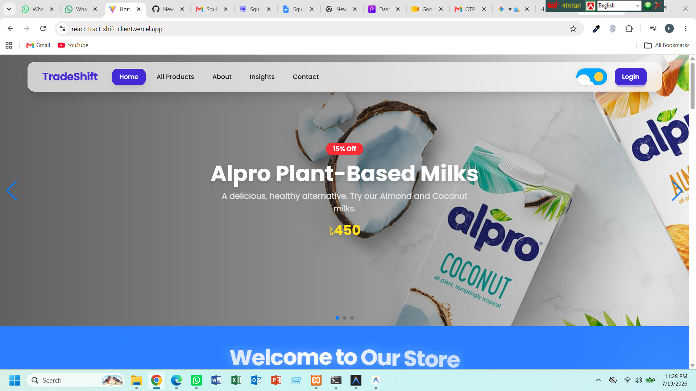

# 🛍️ TradeShift - Backend API

TradeShift Backend is a secure and scalable REST API built with **Node.js**, **Express.js**, and **MongoDB**. It powers the TradeShift e-commerce platform by handling authentication, product management, imports, exports, and database operations through well-structured API endpoints.

🌐 **Live API:** https://your-backend-url.onrender.com

---

# 🖥️ Preview



---

# ✨ Features

- 🔐 Secure REST API built with Express.js
- 📦 Product CRUD Operations
- 📥 Import Product Management
- 📤 Export Product Management
- 👤 User-specific Data Handling
- 🔍 Search & Filtering Support
- 📄 Pagination Support
- 🗄️ MongoDB Database Integration
- ⚡ Fast API Responses
- 🌐 CORS Enabled
- 🔒 Environment Variable Security with dotenv
- 🚀 Ready for Deployment on Render

---

# 🛠️ Tech Stack

## Backend

- Node.js
- Express.js

## Database

- MongoDB
- Mongoose

## Security

- dotenv
- CORS

## Deployment

- Render

---

# 📦 Backend Dependencies

```json
{
  "express": "^4.19.x",
  "mongodb": "^6.x",
  "mongoose": "^8.x",
  "cors": "^2.8.x",
  "dotenv": "^16.x"
}
```

---

# 📂 Project Structure

```
TradeShift-Server/
│
├── routes/
├── controllers/
├── models/
├── middleware/
├── config/
├── .env
├── package.json
├── index.js
└── README.md
```

---

# ⚙️ Local Installation & Setup

## Prerequisites

- Node.js (v18 or later)
- npm
- MongoDB Atlas Account
- Git

---

## 1️⃣ Clone the Repository

```bash
git clone https://github.com/your-username/tradeshift-server.git
```

Move into the project folder:

```bash
cd tradeshift-server
```

---

## 2️⃣ Install Dependencies

```bash
npm install
```

---

## 3️⃣ Create Environment Variables

Create a file named:

```
.env
```

Add the following:

```env
PORT=5000

MONGODB_URI=your_mongodb_connection_string

DB_NAME=tradeshift

JWT_SECRET=your_secret_key
```

---

## 4️⃣ Run the Development Server

```bash
npm run dev
```

or

```bash
npm start
```

The server will run at:

```
http://localhost:5000
```

---

# 📜 Available Scripts

```bash
npm install
```

Install project dependencies.

```bash
npm run dev
```

Starts the development server using nodemon.

```bash
npm start
```

Starts the production server.

---

# 🌐 API Endpoints

| Method | Endpoint | Description |
|---------|----------|-------------|
| GET | `/products` | Get all products |
| GET | `/products/:id` | Get a single product |
| POST | `/products` | Add a new product |
| PUT | `/products/:id` | Update a product |
| DELETE | `/products/:id` | Delete a product |
| GET | `/imports` | Get imported products |
| POST | `/imports` | Import a product |
| GET | `/exports` | Get exported products |
| POST | `/exports` | Add export product |
| PUT | `/exports/:id` | Update export |
| DELETE | `/exports/:id` | Delete export |

---

# 🗄️ Database

The backend uses **MongoDB** for storing:

- Users
- Products
- Imports
- Exports

Mongoose is used for:

- Schema Validation
- Data Modeling
- Query Management

---

# 🔒 Environment Variables

```env
PORT=5000

MONGODB_URI=your_mongodb_connection_string

DB_NAME=tradeshift

JWT_SECRET=your_secret_key
```

---

# 🚀 Deployment

This backend is ready to deploy on **Render**.

### Build Command

```bash
npm install
```

### Start Command

```bash
npm start

---

# 🤝 Contributing

1. Fork the repository.

2. Create a new branch.

```bash
git checkout -b feature-name
```

3. Commit your changes.

```bash
git commit -m "Added new feature"
```

4. Push your branch.

```bash
git push origin feature-name
```

5. Open a Pull Request.

---

# 📄 License

This project is licensed under the MIT License.

---

# 👨‍💻 Author

**Rimi**

GitHub: https://github.com/rimi-1234
